# Grid SW Project Portfolio - Architecture Diagram

## System Overview

This document provides a comprehensive architectural overview of the Grid SW Project Portfolio Dashboard application.

---

## Complete Architecture Diagram

```mermaid
graph TB
    subgraph "Presentation Layer - Frontend"
        A["Browser / Client"]
        B["Login Page<br/>login.html"]
        C["Dashboard<br/>dashboard.html"]
        D["Add Project Form<br/>project/add.html"]
        E["Edit Project Form<br/>project/edit.html"]
        F["Static Assets<br/>CSS / JS / Images"]
    end

    subgraph "Web Framework & Routing Layer"
        G["Flask Application<br/>app.py"]
        H["Authentication<br/>Session Management"]
        I["Project Routes<br/>project_routes.py"]
        J["API Endpoints<br/>/project/*<br/>/api/*"]
    end

    subgraph "Business Logic Layer - Services"
        K["Project Service<br/>project_service.py"]
        L["Validation Service<br/>validation_service.py"]
        M["Audit Trail Service<br/>audit_trail_service.py"]
        N["Config Loader<br/>config.json"]
    end

    subgraph "Data Management Layer - JSON Storage"
        O["Portfolio Data<br/>portfolio.json"]
        P["Audit Log<br/>audit_log.json"]
        Q["Users<br/>users.json"]
        R["Form Spec<br/>project_form_spec.json"]
        S["Audit Config<br/>audit_trail_config.json"]
        T["Dummy Data<br/>portfolio_dummy.json"]
    end

    subgraph "Scheduled Background Tasks"
        U["Background Scheduler<br/>APScheduler"]
        V["Notification Cycle<br/>run_notification_cycle"]
        W["Notification Log<br/>notification_log.json"]
    end

    subgraph "Client-Side Logic - JavaScript"
        X["Dashboard JS<br/>dashboard.js"]
        Y["Form Validation<br/>Client-side checks"]
        Z["AJAX / Fetch API<br/>Real-time validation"]
    end

    %% User Interactions
    A -->|Login| B
    B -->|Authenticate| G
    G -->|Load| H
    H -->|Create Session| C
    
    %% Dashboard Flow
    C -->|GET /api/dashboard| I
    I -->|Query Projects| K
    K -->|Read| O
    K -->|Get LOV| R
    K -->|Get Audit| M
    M -->|Read| P
    C -->|Execute| X
    X -->|Format & Display| C
    
    %% Add Project Flow
    C -->|Navigate| D
    D -->|GET /project/add| I
    I -->|Get Form Spec| K
    I -->|Get LOVs| R
    D -->|User Input| Y
    Y -->|Blur/Change| Z
    Z -->|POST /project/api/validate-names| I
    I -->|Check Duplicates| K
    K -->|Query| O
    D -->|Submit| Z
    Z -->|POST /project/add| I
    I -->|Validate Form| L
    L -->|Check Rules| R
    L -->|Validate Emails<br/>Check Duplicates| L
    
    %% Create Project
    I -->|Valid Data| K
    K -->|Generate ID<br/>Set Timestamps| K
    K -->|Append Project| O
    K -->|Log Creation| M
    M -->|Append Entry| P
    M -->|Save| P
    K -->|Response| D
    
    %% Edit Project Flow
    C -->|Click Edit| E
    E -->|GET /project/:id/edit| I
    I -->|Get Project| K
    K -->|Read| O
    E -->|Submit Changes| I
    I -->|Validate| L
    I -->|Update| K
    K -->|Update Project| O
    K -->|Log Changes| M
    M -->|Track Fields<br/>Old/New Values| P
    
    %% Project Status Update
    C -->|Update Status| X
    X -->|PUT /project/:id/status| I
    I -->|Update Status Fields| K
    K -->|Log Field Changes| M
    
    %% Scheduled Tasks
    U -->|Daily 6 AM| V
    V -->|Run Cycle| K
    K -->|Generate Notifications| V
    V -->|Log Results| W
    
    %% Configuration & Forms
    G -->|Load Config| N
    N -->|Enable Scheduler| U
    G -->|Initialize Users| Q
    
    %% Data Flow Styling
    style A fill:#e1f5ff
    style B fill:#e1f5ff
    style C fill:#e1f5ff
    style D fill:#e1f5ff
    style E fill:#e1f5ff
    style F fill:#e1f5ff
    
    style G fill:#fff3e0
    style H fill:#fff3e0
    style I fill:#fff3e0
    style J fill:#fff3e0
    
    style K fill:#f3e5f5
    style L fill:#f3e5f5
    style M fill:#f3e5f5
    style N fill:#f3e5f5
    
    style O fill:#e8f5e9
    style P fill:#e8f5e9
    style Q fill:#e8f5e9
    style R fill:#e8f5e9
    style S fill:#e8f5e9
    style T fill:#e8f5e9
    
    style U fill:#fce4ec
    style V fill:#fce4ec
    style W fill:#fce4ec
    
    style X fill:#f1f8e9
    style Y fill:#f1f8e9
    style Z fill:#f1f8e9
```



---

## Architecture Layers Explained

### 1. **Presentation Layer (Frontend)**
| Component | File | Purpose |
|-----------|------|---------|
| Login Page | `login.html` | User authentication interface |
| Dashboard | `dashboard.html` | Main project portfolio view with filters, search, pagination |
| Add Project Form | `project/add.html` | Form to create new projects |
| Edit Project Form | `project/edit.html` | Form to modify existing projects |
| Static Assets | `static/css/`, `static/js/`, `static/images/` | Styling, client-side logic, assets |

### 2. **Web Framework & Routing Layer**
| Component | File | Purpose |
|-----------|------|---------|
| Flask App | `app.py` | Main application entry point, session management |
| Authentication | `app.py` | User login/logout, session persistence |
| Project Routes | `project_routes.py` | RESTful API endpoints for project operations |
| API Endpoints | `project_routes.py` | GET/POST/PUT/DELETE operations |

**Key Endpoints:**
- `GET /project/add` - Add project form
- `POST /project/add` - Create project
- `GET /project/<id>/edit` - Edit project form
- `POST /project/<id>/edit` - Update project
- `PUT /project/<id>/status` - Update status
- `GET /api/dashboard` - Get dashboard data
- `GET /api/lovs` - Get Lists of Values
- `GET /project/api/validate-names` - Check name duplicates

### 3. **Business Logic Layer (Services)**
| Service | File | Responsibilities |
|---------|------|------------------|
| **Project Service** | `project_service.py` | CRUD operations, search, filtering, grouping, status workflows |
| **Validation Service** | `validation_service.py` | Form validation, field rules, cross-field dependencies, email format validation |
| **Audit Trail Service** | `audit_trail_service.py` | Track all changes, log creation/updates/deletions with user context |

**Project Service Methods:**
- `create_project()` - Create new project with validation
- `get_project()` - Retrieve by ID
- `update_project()` - Update with audit logging
- `validate_project_form()` - Validate submission
- `get_dashboard_data()` - Dashboard queries with filters
- `validate_name_pair()` - Live duplicate check for add form

**Validation Service Methods:**
- `validate_form()` - Full form validation
- `_validate_field()` - Individual field validation
- `_validate_enum()` - Dropdown/LOV validation
- `_validate_email()` - Email format check
- `set_defaults()` - Apply form defaults
- `set_system_generated_values()` - Auto-compute fields

### 4. **Data Layer (JSON Files)**
| File | Purpose |
|------|---------|
| `portfolio.json` | Main project records (CRUD operations) |
| `audit_log.json` | Complete audit trail of all changes |
| `users.json` | User credentials and roles |
| `project_form_spec.json` | Form schema, validation rules, LOVs |
| `audit_trail_config.json` | Audit configuration |
| `portfolio_dummy.json` | Seed data for new instances |
| `notification_log.json` | Scheduled notification history |

**Sample Portfolio Structure:**
```json
{
  "projects": [
    {
      "project_id": "PRJ-ABC12345",
      "initiative_name": "String",
      "project_name": "String",
      "description": "String",
      "dt_team_accountable": "String",
      "state": "Active|Evaluation|Funnel|Hold|Closure|Cancelled",
      "project_otd_status": "On Track|Adjusted plan|Slip",
      "project_otd_phase": "Discovery|Agile|Build|Launch|Requirements|Verify|Post-Launch",
      "category": "MustDo|Strategic/LTGrowth|Productivity",
      "business_unit": "All|Grid|Mfg|PERS|Electrification",
      "primary_function": "All|Commercial|Customer Success|Engineering|Finance|Marketing|M&A|DT",
      "region": "Global|EMEA|North America|Asia Pacific",
      "executive_sponsor": "email@example.com",
      "dt_teams_involved": "String (LOV-based pick)",
      "dt_lead": "email@example.com",
      "business_project_lead": "email@example.com",
      "budget": "Number",
      "level_of_effort": "Small|Medium|Large|XLarge|XXL|TBD",
      "created_at": "ISO timestamp",
      "updated_at": "ISO timestamp"
    }
  ]
}
```

### 5. **Client-Side Logic (JavaScript)**
| Component | File | Purpose |
|-----------|------|---------|
| Dashboard Logic | `dashboard.js` | Filter, search, pagination, grouping, sort |
| Form Validation | `project/add.html` | Real-time field validation, immediate error display |
| AJAX/Fetch API | `project/add.html` | Non-blocking name-pair duplicate check on blur |

**Client-Side Validations:**
- Project Status field visibility
- OTD Status required when State = "Active"
- Adjusted End Date visibility/requirement
- Phase mandatory for all states
- Real-time name duplicate checking via `/project/api/validate-names`

### 6. **Scheduled Background Tasks**
| Component | Purpose |
|-----------|---------|
| APScheduler (optional) | Configurable scheduled job runner |
| Notification Cycle | Runs daily at configured time to process notifications |
| Notification Log | Persistent log of all scheduled runs |

---

## Key Data Flows

### **Flow 1: Project Creation**
```
User Input (Add Form)
    ↓
Client-side Validation (HTML5, JS)
    ↓
Live Duplicate Check via API
    ↓
Form Submit → POST /project/add
    ↓
Validation Service (Full Validation)
    ↓
Duplicate Check via Service
    ↓
Project Service (Generate ID, Timestamps)
    ↓
Save to portfolio.json
    ↓
Log in audit_log.json via Audit Service
    ↓
Return project_id to user
```

### **Flow 2: Project Update**
```
User Edits Fields
    ↓
Form Validation
    ↓
Submit → POST /project/:id/edit
    ↓
Retrieve Current Project
    ↓
Merge Changes
    ↓
Full Validation
    ↓
Compare Old/New Values
    ↓
Update portfolio.json
    ↓
Log Each Field Change with Before/After
    ↓
Audit Trail Entry Saved
```

### **Flow 3: Dashboard Display**
```
User Opens Dashboard
    ↓
GET /api/dashboard + Filter Params
    ↓
Project Service Queries portfolio.json
    ↓
Apply Filters, Search, Group
    ↓
Fetch Related Audit Data
    ↓
JSON Response to Frontend
    ↓
dashboard.js Formats and Renders
```

### **Flow 4: Real-Time Name Validation**
```
User Types Project/Initiative Name
    ↓
On Blur Event
    ↓
JavaScript Validates Format
    ↓
Fetch GET /project/api/validate-names
    ↓
Service Calls validate_name_pair()
    ↓
Query portfolio.json for Duplicates
    ↓
Return {valid: true/false, message: "..."}
    ↓
Display Red Error Message or Clear
```

---

## Technology Stack

| Layer | Technology |
|-------|-----------|
| **Frontend** | HTML5, CSS3, JavaScript (ES6+), Fetch API |
| **Backend** | Python 3.x, Flask, Jinja2 Templates |
| **Database** | JSON files (File-based storage) |
| **Scheduling** | APScheduler (optional, background tasks) |
| **Validation** | Python (server-side), HTML5 + JS (client-side) |
| **Audit** | Custom Python service with JSON persistence |

---

## Security Considerations

1. **Authentication:** Session-based with username/password (users.json)
2. **Authorization:** Role-based (Admin) with permission checks
3. **Input Validation:** Server-side validation for all incoming data
4. **Email Validation:** Format checking for required email fields
5. **CSRF Protection:** Flask session management
6. **Data Integrity:** Audit trail logging all changes

---

## Deployment Architecture

```
┌─────────────────────────────────────┐
│      User Browser / Client          │
│  (Chrome, Firefox, Safari, Edge)    │
└────────────────────┬────────────────┘
                     │ HTTP/HTTPS
                     ↓
        ┌────────────────────────┐
        │   Flask Web Server     │
        │   (http://0.0.0.0:5000)│
        │   - app.py             │
        │   - Project Routes     │
        │   - Services           │
        └────────────┬───────────┘
                     │
    ┌────────────────┼────────────────┐
    ↓                ↓                ↓
┌─────────┐   ┌──────────────┐   ┌──────────────┐
│Jinja2   │   │ Business     │   │ Background   │
│Templates│   │ Logic Layer  │   │ Scheduler    │
│(HTML)   │   │ (Services)   │   │ (APScheduler)│
└─────────┘   └──────────────┘   └──────────────┘
    ↓                ↓                ↓
    └────────────────┼────────────────┘
                     ↓
           ┌──────────────────┐
           │   File System    │
           │   (data/*.json)  │
           │ - portfolio.json │
           │ - audit_log.json │
           │ - users.json     │
           │ - Configs & LOVs │
           └──────────────────┘
```

---

## Form Field Dependencies & Validation Rules

### Mandatory Fields
- Initiative Name (text, 1-255 chars)
- Project Name (text, 1-255 chars)
- Description (textarea, 1-2000 chars)
- DT Team Accountable (LOV select)
- State (LOV select, default: Evaluation)
- Phase (LOV select, default: Discovery)
- Executive Sponsor (email, required)
- DT Lead (email, required)
- Business Project Lead (email, required)

### Conditional Rules
1. **OTD Status:**
   - Required when State = "Active"
   - Must be NULL when State = Funnel/Evaluation/Hold

2. **Phase:**
   - Always required (even for Funnel state)

3. **Adjusted End Date:**
   - Visible/Required when OTD Status = "Adjusted Plan"
   - Must be >= Estd. End Date

4. **Category:**
   - Required when State = "Funnel"

### LOVs (Lists of Values)
- **DT Team:** Data & AI, Enterprise Applications, Technology Enablement & Transformation, Product Tech Solutions & Operations
- **Region:** Global, EMEA, North America, Asia Pacific
- **Business Unit:** All, Grid, Mfg, PERS, Electrification (displayed as CAPS)
- **Phase:** Discovery, Agile, Build, Funnel, Launch, Requirements, Verify, Post-Launch
- **Effort Level:** Small, Medium, Large, XLarge, XXL, TBD
- **Project Status:** G (Green), R (Red), Y (Yellow), NA, Hold

---

## Performance Considerations

1. **Caching:** Form LOVs loaded once per session
2. **Pagination:** Dashboard supports 10-100 items per page
3. **Filtering:** Server-side filtering reduces data transfer
4. **Async Validation:** Client-side async name check prevents form blocking
5. **Lazy Loading:** Budget/Benefits fields rendered dynamically

---

## File Structure Summary

```
Project Root/
├── app.py                           # Main Flask application
├── config.json                      # App configuration
├── requirements.txt                 # Python dependencies
├── README.md                        # Documentation
├── templates/
│   ├── base.html                   # Base template (layout)
│   ├── login.html                  # Login page
│   ├── dashboard.html              # Main dashboard
│   └── project/
│       ├── add.html                # Add project form
│       └── edit.html               # Edit project form
├── static/
│   ├── css/
│   │   └── style.css              # Styling
│   ├── js/
│   │   └── dashboard.js           # Dashboard logic
│   └── images/
├── services/
│   ├── project_service.py         # Core business logic
│   ├── project_routes.py          # API endpoints
│   ├── validation_service.py      # Form validation
│   └── audit_trail_service.py     # Change tracking
├── data/
│   ├── portfolio.json             # Project data
│   ├── audit_log.json             # Audit trail
│   ├── users.json                 # User credentials
│   ├── project_form_spec.json     # Form schema & LOVs
│   ├── audit_trail_config.json    # Audit config
│   ├── portfolio_dummy.json       # Seed data
│   └── notification_log.json      # Notification history
└── scripts/                        # Utility scripts
    ├── add_2027_budget_fields.py
    ├── fix_import.py
    └── regenerate_dummy.py
```

---

## Summary

This architecture implements a **3-tier MVC-style web application** with:
- **Presentation Layer:** Responsive HTML templates with client-side validation
- **Business Logic Layer:** Modular Python services for projects, validation, and auditing
- **Data Layer:** JSON-file-based persistent storage with audit logging

All components are tightly integrated for a cohesive portfolio management experience with real-time validation, audit trails, and flexible project filtering.

